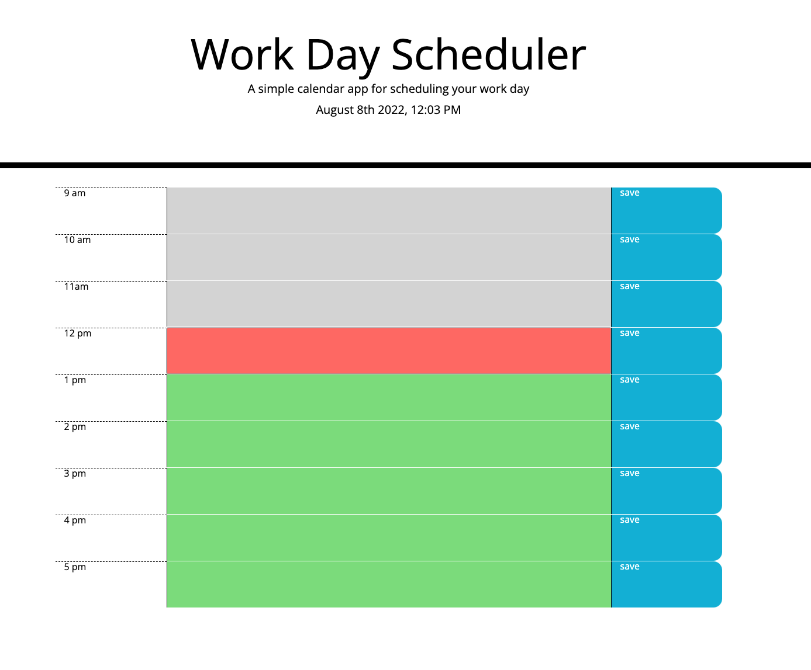

# Challenge 5 - Daily Planner

    This challenge was to make a daily planner for work hours of a typical employee which is 9am to 5pm.  /nThis challenge provided starter code for HTML and CSS and I had to write all the Javascript code.  This challenge involved using jQuery which even though is in its sunsetting years is still a useful thing to know because it will still be around for the next five or so years.  The other point of this challenge was to use third party API's like jQuery, bootstrap and moment.js.  JSON was also used in this project.

Description:

    A simple daily calendar to write down tasks to do during working hours and have them saved to local storage.

Installation:

    Access URL to use. Go to deployed site [here](https://illtron3030.github.io/C5_Daily_Planner/).

Usage:

    Scheduling tasks at work.

What I learned:

    I learned that after reading lots of documentation on third partry API's and then using them in this project that they are a very useful and powerful tool.  Sometimes there is no sane reason to build something from scratch when it has been done perfectly already.

Why I Made This Project:
    
    To further my knowledge in the use of third party API's and put them to use for a simple but useful daily calendar tool.

Challanges:

    Unlike Bootstrap, jQuery confused me somewhat.  However, once I read documentation and we did some excercises in class I began to see how handy it can be for DOM traversal/manipulation, event handling, and AJAX.  I was put off by it at first knowing that is has fallen out of popularity because some of the aspects that made it so useful are no longer issues.  After implementing it I can see how it will still be in use for several more years. 

Mock Up:

